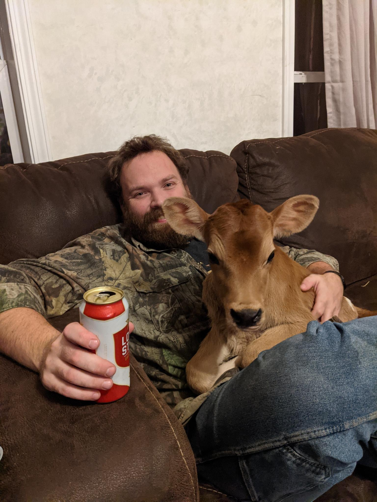

:PROPERTIES:
:AUTHOR: Ian S. Pringle
:CREATED: <2022-08-04 Thu>
:MODIFIED: <2026-08-10 Sun>
:TYPE: about
:END:
#+title: About

# Howdy, I'm Ian.

#+NAME: Elsa and I
#+CAPTION: A new-born Elsa and I, sitting on a couch enjoying a beer.
#+ATTR_HTML: :float right :width 300px :margin 1rem

I'm a sinner saved by grace. I am a husband and father.

I work as a software developer by day, but after hours I try to keep technology
in its place—I am something of a neo-Luddite, and I work hard to balance modern
tools with a desire to work with my hands.

My interests are many and varied. I have a degree in New Testament studies, with
a minor in Koine Greek, and I love studying and discussing theology. I live on a
farm in very rural Missouri with my wife and children.

I am also drawn to the Middle Ages—their literature above all, but also the
languages that carried it, Latin and Old English, and the wider imaginative
world those texts inhabit: the theology that ordered it, the cosmologies that
mapped heaven and earth, and the myths and legends that still cling to the
margins of the page. This site is where that reading finds a home.
