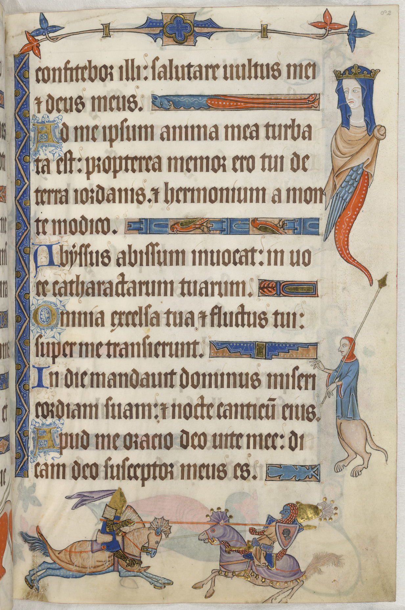

:PROPERTIES:
:AUTHOR: Ian S. Pringle
:CREATED: <2022-08-04 Thu>
:MODIFIED: <2026-08-10 Sun>
:TYPE: root
:END:
#+title: Index

#+NAME: Luttrell Psalter Illumination
#+CAPTION: A page from the Luttrell Psalter
#+ATTR_HTML: :float right :width 300px :margin 1rem

Drollery is a site devoted to medieval literature, with particular attention to
the texts that survive in manuscript and the images that live in their margins.

The word /drollery/ originally referred to the small, often humorous or grotesque
drawings found in the margins of medieval books—hybrids, animals out of place,
clerical satire, and other playful interruptions of the page. Related terms
include /marginalia/ and /grotesques/. The modern sense of the word (something
whimsical or oddly amusing) grew from the same root.

This site takes both senses seriously. The primary work is in the
[[./folio/][Folio]]: substantial entries on medieval texts, with context,
transcription or translation where useful, and proper sources. The
[[./marginalia/][Marginalia]] section holds the images, notes, observations, and
related sources collected along the way while gathering those texts—material
that illuminates, echoes, or simply belongs beside the medieval works.

The project is deliberately limited. It is not a comprehensive medieval studies
resource, nor a personal blog. It exists to give careful attention to particular
texts and the visual and literary world that surrounds them.
